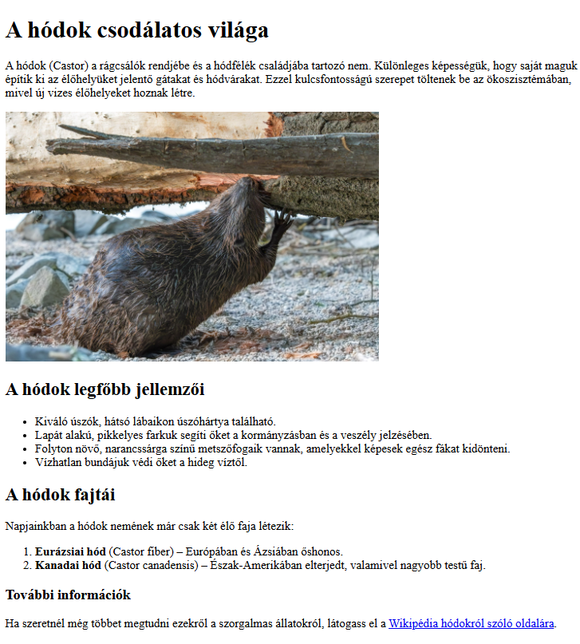
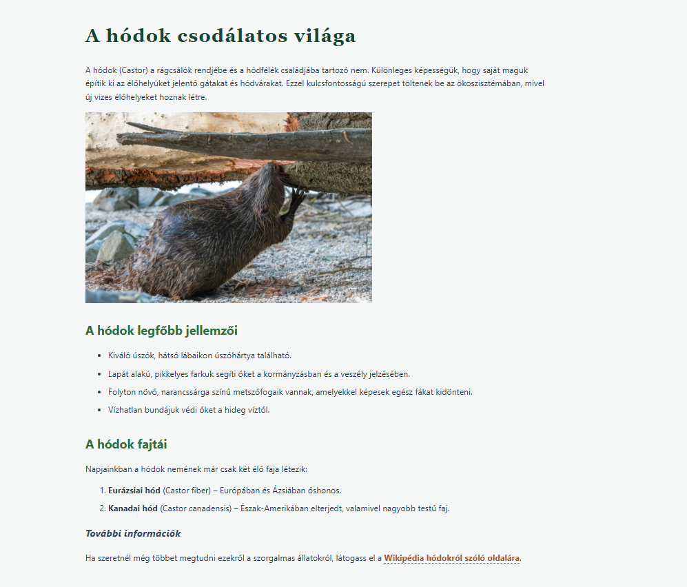
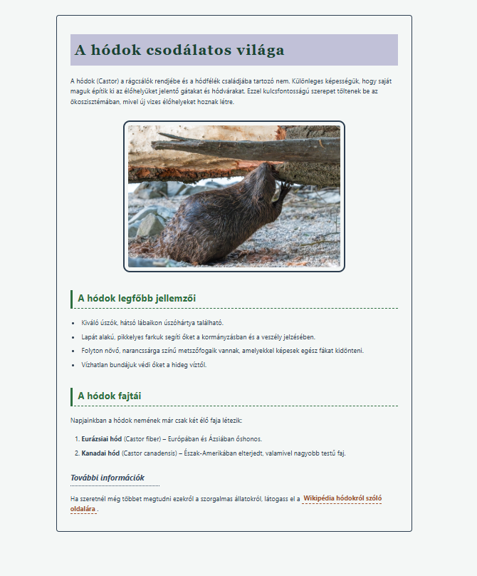
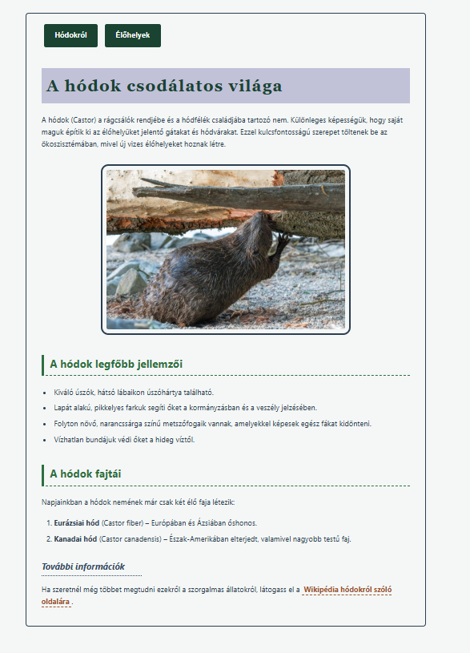
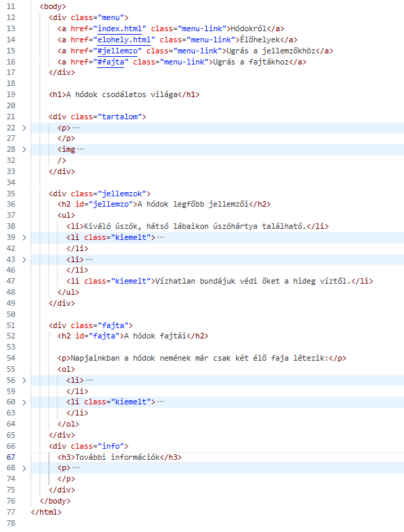
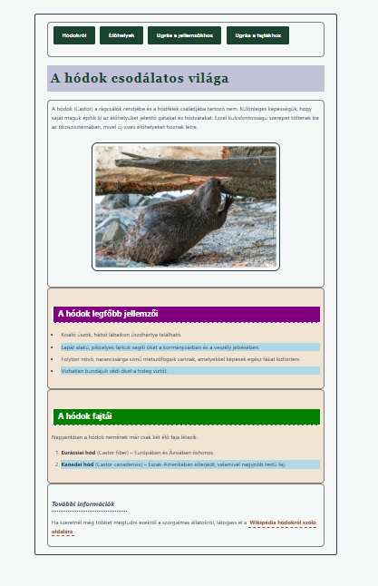
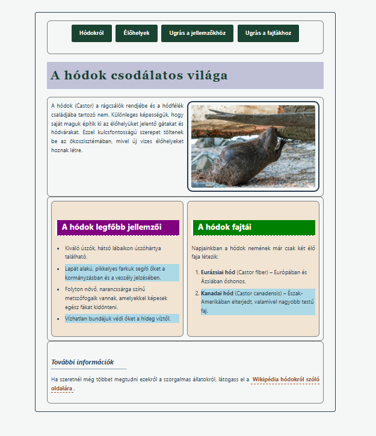
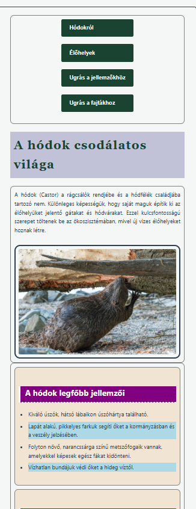

# HTML és CSS alapok lépésről lépésre

Az alábbiakban  lépésenként fogjuk felépíteni reszponzív weboldalunkat. 
Az egyes témakörökhöz elméleti anyagot itt találsz: https://etananyag.szamalk-szalezi.hu/course/view.php?id=2278&section=1

A 00_kiindulas mappában lévő fájlokból indulj ki. Itt találod lépésről lépésre a mintákat, a szövegeket és a képeket. 

https://github.com/csefikatalin/htmls_css_alapok/tree/main/00_kiindulas

## 1. HTML alapok

A feladat a mintán található index.html oldal elkészítése.

### A minta: 

A megoldás: https://github.com/csefikatalin/htmls_css_alapok/tree/main/01_HTML_alapok

## 2. CSS alapok

A feladat az előzőekben elkészült index.html oldal text és font formázása css-sel.

### A minta: 

A megoldás: https://github.com/csefikatalin/htmls_css_alapok/tree/main/02_CSS-alapok 

## 3. BOX modell

A feladat az előzőekben elkészült oldal formázása box modell alapján: paddingok, margók és szegélyek készítése a minta alapján.

### A minta: 

A megoldás: https://github.com/csefikatalin/htmls_css_alapok/tree/main/03_BOX_modell 

## 4. Navigáció készítése

Az előző feladatot egészítsd ki a navigáció elkészítésével! 
Hozz létre egy elohely.html oldalt, melynek tartalmát az elohely.txt-ben olvashatod. 
A menü formázási utasításait az új mintán látod, illetve a formazasi_utasitasok.txt-ben olvashatod. 

### A minta: 

A megoldás: https://github.com/csefikatalin/htmls_css_alapok/tree/main/04_NAVIGACIO_keszitese  

## 5. Id és a Class

Az előző feladatot egészítsd ki az alábbiak szerint! 

Helyezz el az index.html oldalon id és class attribútumokat.

1. Minden második li-taget lásd el "kiemelet" classnévvel <li class="kiemelt"><...li>
2. Formázd meg css-sel a "kiemelt" osztályt! legyen a hátterük világoskék!
3. A hódok jellemzői címhez adj egy id-t, "jellemzo" néven.
4. A hódok fajtái címhez adj egy id-t, "fajta" néven.
5. Formázd a css-ben lila hátérrel a jellemzo-t és zöld hátérrel a fajta-t!
6. Készíts menüt, ami az oldalon a fajta és a jellemző részekhez navigál!

Megoldás:  https://github.com/csefikatalin/htmls_css_alapok/tree/main/05_ID_CLASS_hasznalata

## 6. Div és a span elem

Az előző feladatot egészítsdki az alábbiak szerint: 

A divekkel és a span elemekkel egységbe forglalhatunk logikailag összetartozó tartalmakat. Ezután együtt formázhatjuk is őket. 

Helyezd el a html  oldaladon a   mintának megfelelően a div-eket. 

Ezután formázd őket a mintának  megfelőelen. 

Megoldás:  https://github.com/csefikatalin/htmls_css_alapok/tree/main/06_DIV_SPAN_elem

## 7. Elrendezés gridekkel

Az előző feladatot egészítsdki az alábbiak szerint! 

A feladat a mintán látott elrendezés kialakítása.

A tartalom class névvel ellátott divben lévő elemeket szeretnénk egymás mellé helyezni. A .tartalom div a szülőelem, ezért erre kell rátaenni a grid utasításokat. 

Hasonló módon, ha a hódok jellemzőit és a hódok fajtái diveket egymás mellé szeretnénk tennia, akkor a két divet még egy divvel össze kell fogni. Ennek a  divnek is elhet a class neve a tartalom. 

A menü kialakításáhz is használhatunk div-eket. Itt érdemes a

.menu {
    display:grid;
    grid-auto-flow:column ;
    justify-content: center;
}
kódsort használni. Ezzel a menü szövegének méretéhez fog illeszkedni a rács mérete és a justify-content utasítással középre lesz igazítva. 

Megoldás:  https://github.com/csefikatalin/htmls_css_alapok/tree/main/07_grid

## 8. Reszponzivitás

Az előző feladatot egészítsd ki az alábbiak szerint! 

A feladat a mintán látott elrendezés kialakításánák módosítása, ha a képernyő mérete 700px alá csökken. 

Helyezz el egy media queryt a grid-es css-ben!

Itt változtasd meg a

- body méretét, most legyen 100%
- a betméretet is a teljes oldalon (p, li tagek) font-size:calc( 12px + 2vw)
- a tartalom div legyen egy oszlopos
- a menü ne sorokban, hanem oszlopokban jelenjen meg. 

Megoldás:  https://github.com/csefikatalin/htmls_css_alapok/tree/main/08_reszponzivitas

## 9. HTML5 szemantikus elemek

Módosítsd a HTML oldal szerkezetét HTML szemantikus elemekkel: 

Megoldás:  https://github.com/csefikatalin/htmls_css_alapok/tree/main/09_oldalalakitas_html5_szemantikus_elemekkel
